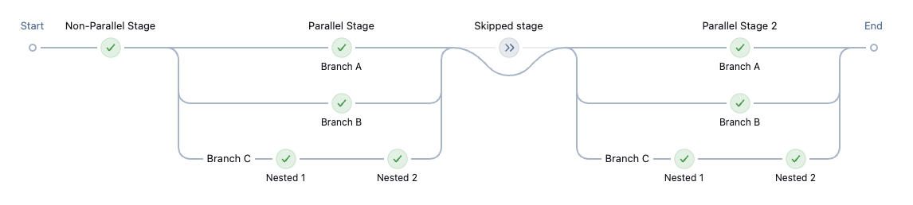

# Pipeline Graph View Plugin

## Introduction

This plugin provides new Action and View to view a `WorkflowRun` via the "Pipeline Graph" visualization that was popularized in the [Blue Ocean plugin](https://github.com/jenkinsci/blueocean-plugin).

## Getting started

1. Install the `pipeline-graph-view` plugin
2. Go to a pipeline run (not a job page)
3. Click 'Pipeline Graph'

## Screenshots

Basic pipeline:

Semi-complex pipeline:

## Video

See a live demonstration from a Jenkins Contributor Summit:

## Vision

This plugin aims to bring the best of Blue Ocean into the regular Jenkins UI.

That means functionality like:

* [x] Pipeline graph
* [x] Summary of runs in a job (like [Pipeline Stage View Plugin](https://github.com/jenkinsci/pipeline-stage-view-plugin/), but simpler, more modern and more performant)
* [x] Modern logs viewing

The plugin should be lightweight, using or providing extension points where possible rather than building everything into one plugin.

## Contributing

Any help is much appreciated, the frontend code is written in React, the backend code is in Java, designers would be greatly appreciated as well.

Refer to our [contribution guidelines](./CONTRIBUTING.md)
