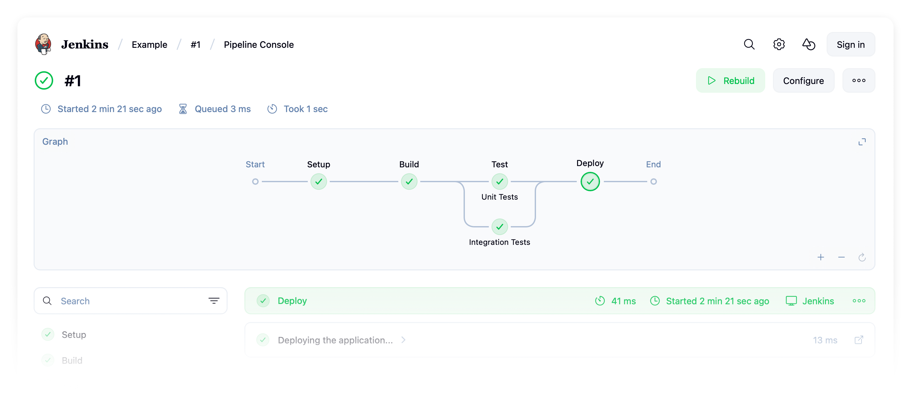

# Pipeline Graph View Plugin

## Introduction

This plugin adds a visual representation of Jenkins pipelines, showing each stage of a run in a clear and easy-to-follow graph format. It’s designed to make pipeline progress and structure easier to understand at a glance.

## Features

- Visualize pipelines as an interactive, nested graph
- Navigate pipeline stages in a clear, collapsible list view
- View logs in real time without leaving the interface
- Toggle between graph and stage views; move and resize panes to suit your workflow
- Quickly access details of each step and its results
- Designed for better readability and faster troubleshooting

## Getting started

1. Install the [pipeline-graph-view](https://plugins.jenkins.io/pipeline-graph-view/) plugin
2. Go to a pipeline run (not a job page)
3. Click 'Pipeline Console'

## Screenshots

Basic pipeline:

Semi-complex pipeline:

## Video

See a live demonstration from a Jenkins Contributor Summit:

## Contributing

Refer to our [contribution guidelines](./CONTRIBUTING.md).

## LICENSE

Licensed under MIT, see [LICENSE](LICENSE.md).
