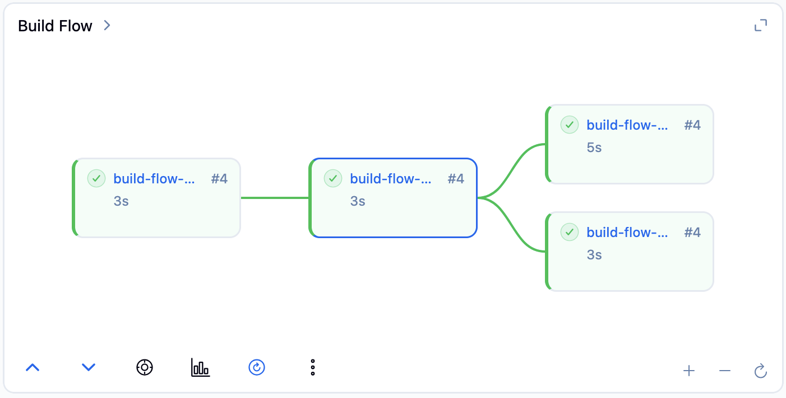

# Build Flow

The Build Flow view provides a zoomable, pannable DAG (directed acyclic graph) visualization of pipeline stages, inspired by the [Yet Another Build Visualizer](https://plugins.jenkins.io/yet-another-build-visualizer/) plugin.

## Accessing Build Flow

- On the build page Overview tab, the Build Flow card appears when upstream/downstream builds exist
- On the build page Stages tab, the Build Flow pane is embedded in the split view
- On the job page, the Build Flow widget shows the latest build's graph
- Users can toggle the job page widget via the gear icon on the Stages card (no admin access needed)

## Capabilities

- Zoom and pan with mouse wheel / trackpad; pinch-to-zoom on touch devices
- Center / zoom-to-fit controls
- Toggle between DAG and flat grid layouts
- Show/hide edge connections, stage labels, duration, and status badges
- Auto-refresh while the build is in progress
- Build history dots showing recent build results (click to navigate)
- Compact summary and widget views embedded in the build/job pages

## Screenshot

